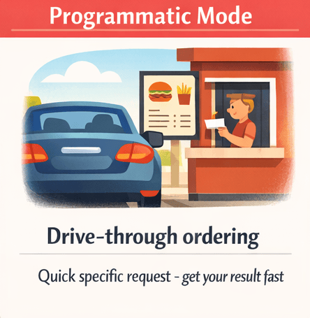

> **AIが瞬時にバグを見つけ、難しいコードを分かりやすく説明し、動くスクリプトを生成する様子を見てください。その後、GitHub Copilot CLIの3つの使い方を学びます。**

この章から実践が始まります。GitHub Copilot CLIが「頼れるシニアエンジニアのようだ」と評される理由を体験できます。AIが数秒でセキュリティの問題を見つけ、複雑なコードを平易な英語で説明し、動作するスクリプトを即座に生成します。その後、Interactive、Plan、Programmatic の3つの操作モードを習得し、状況に応じて最適なモードを選べるようになります。

> ⚠️ **前提条件**: まず **[Chapter 00: Quick Start](../00-quick-start/README.md)** を完了してください。以下のデモを実行するには、GitHub Copilot CLIがインストール済みで認証されている必要があります。

## 🎯 学習目標

この章を終える頃には、以下ができるようになります:

- ハンズオンデモを通してGitHub Copilot CLIによる生産性向上を体験する
- タスクに対して適切なモード（Interactive、Plan、Programmatic）を選べるようになる
- スラッシュコマンドを使ってセッションを操作できるようになる

> ⏱️ **推定時間**: 約45分（読書15分＋ハンズオン30分）

---

# 最初のCopilot CLI体験


さっそく操作して、Copilot CLIの実力を確かめてみましょう。

---

## 慣れるための最初のプロンプト

派手なデモに入る前に、まずはすぐ試せる簡単なプロンプトから始めます。**リポジトリは不要**です。ターミナルを開いてCopilot CLIを起動してください:

```bash
copilot
```

以下の初心者向けプロンプトを試してみてください:

```
> Explain what a dataclass is in Python in simple terms

> Write a function that sorts a list of dictionaries by a specific key

> What's the difference between a list and a tuple in Python?

> Give me 5 best practices for writing clean Python code
```

Pythonを使っていなくても大丈夫です。自分の使う言語について質問してください。

自然な会話のように入力できます。探索が終わったら `/exit` と入力してセッションを終了します。

**ポイント**: GitHub Copilot CLIは会話型です。特別な構文は不要で、普通の英語で質問すれば始められます。

## 実際に見てみよう

なぜこれが「頼れるシニアエンジニアのようだ」と呼ばれるのか、実例で確認します。

> 📖 **例の読み方**: `>` で始まる行は、インタラクティブなCopilot CLIセッション内で入力するプロンプトです。`>` のない行はターミナルで実行するシェルコマンドです。

> 💡 **出力例について**: 本コースで示す出力は例示です。Copilot CLIの応答は毎回変わるため、表現や詳細は異なります。返ってくる情報の「種類」に注目してください。

### デモ1: 数秒でできるコードレビュー

このコースには意図的に品質に問題のあるサンプルファイルが含まれています。ローカルで作業していてまだリポジトリをクローンしていない場合は、以下を実行して `copilot-cli-for-beginners` フォルダに移動し、`copilot` を起動してください。

```bash
# リポジトリをまだクローンしていない場合
git clone https://github.com/github/copilot-cli-for-beginners
cd copilot-cli-for-beginners

# Copilot を起動
copilot
```

インタラクティブセッションに入ったら、次を実行します:

```
> Review @samples/book-app-project/book_app.py for code quality issues and suggest improvements
```

> 💡 **`@` 記号は何に使う？** `@` は Copilot CLI にファイルを読ませるための記法です。詳しくは Chapter 02 で学びます。ここではそのままコピーして使ってください。

---

<details>
<summary>🎬 実演を見る</summary>


*デモの出力は環境やモデルによって異なります。*

</details>

---

**まとめ**: 短時間で専門的なレビューが得られます。手動レビューよりずっと短時間です。

---

### デモ2: 分かりにくいコードを説明してもらう

コードを見て「これ何だろう？」となったときは、Copilot CLIで次のように聞いてみてください:

```
> Explain what @samples/book-app-project/books.py does in simple terms
```

---

<details>
<summary>🎬 実演を見る</summary>


*デモの出力は環境やモデルによって異なります。*

</details>

---

**何が起きるか**: Copilot CLIがファイルを読み、コードの動きを理解して平易な言葉で説明してくれます。

```
（例）このモジュールはPythonのdataclassを使った書籍コレクション管理です。

ポイント:
- Bookはdataclassで、タイトル、著者、年、既読フラグなどを持つ
- BookCollectionはコレクションを管理し、JSONファイルの読み書きを行う

主要な機能:
- add_book() - 書籍を追加して保存
- find_book_by_title() - タイトルで検索
- mark_as_read() - 既読にする
- find_by_author() - 著者で絞り込む

共通パターン: JSONから読み込む → Pythonオブジェクトで操作 → JSONに書き戻す
```

**まとめ**: 難しいコードもメンターが丁寧に説明してくれるように理解できます。

---

### デモ3: 動くコードを生成する

15分ほど調べる必要がある処理も、セッション内で一発生成できます:

```
> Write a Python function that takes a list of books and returns statistics: 
  total count, number read, number unread, oldest and newest book
```

---

<details>
<summary>🎬 実演を見る</summary>


*デモの出力は環境やモデルによって異なります。*

</details>

---

**何が起きるか**: 実行可能な関数が短時間で生成され、コピーしてすぐ使えます。

探索が終わったら、セッションを終了します:

```
> /exit
```

**まとめ**: その場で完結する満足感があり、継続的なセッションで効率よく作業できます。

---

# モードとコマンド


Copilot CLIの可能性を見たところで、どのように使い分けるかを理解しましょう。重要なのは、目的に応じて3つのモードを使い分けることです。

> 💡 **補足**: Copilot CLIには **Autopilot** モードもあり、ユーザーの入力を待たずにタスクを進めます。強力ですが、全権限の付与やプレミアムリクエストの利用を伴います。本コースではまず3つの基本モードに焦点を当てます。慣れてきたらAutopilotの公式ドキュメントを参照してください。

---

## 🧩 実生活の比喩: 外食に例えると

GitHub Copilot CLIの使い方は、外食に行くときの流れに似ています。行き先の計画から注文まで、状況に応じて適切なアプローチを選びます。

| モード | 外食のたとえ | いつ使うか |
|------|----------------|-------------|
| **Plan** | レストランまでのルートを決める（GPS） | 複雑な作業の計画を立てるとき |
| **Interactive** | ウェイターと会話する | 探索や反復が必要な作業 |
| **Programmatic** | ドライブスルーでさっと注文する | 単発で素早く結果が欲しいとき |

状況に合わせて自然に使い分けられるようになります。


*複雑な作業はPlan、対話的な調整はInteractive、即答が欲しいときはProgrammaticを選びましょう。*

### どのモードから始めるべき？

**まずはInteractive modeをおすすめします。**
- 実験やフォローアップがしやすい
- 会話を通じてコンテキストが自然に構築される
- `/clear` で簡単にやり直せる

慣れてきたら:
- **Programmatic mode**（`copilot -p "<your prompt>"`）で即答を得る
- **Plan mode**（`/plan`）で詳細な設計を作る

---

## 3つのモード

### モード1: Interactive Mode（まずはここから）


**向いている場面**: 探索、反復、マルチターンの会話。ウェイターと会話しながら注文を調整するイメージです。

インタラクティブセッションを開始:

```bash
copilot
```

ここでは自然な文章が打て、利用可能なコマンドを確認するには:

```
> /help
```

**ポイント**: Interactiveはコンテキストを保持します。各メッセージが前のやりとりを踏まえます。

#### Interactiveの例

```bash
copilot

> Review @samples/book-app-project/utils.py and suggest improvements

> Add type hints to all functions

> Make the error handling more robust

> /exit
```

各プロンプトが前の回答を踏まえて進んでいく点に注目してください。

---

### モード2: Plan Mode


**向いている場面**: 実装前に方針をレビューしたい複雑なタスク。GPSで経路を決めるイメージです。

`/plan` コマンドを使うか、セッション中に **Shift+Tab** を押してPlan Modeに切り替えます。

> 💡 **Tip**: **Shift+Tab** で Interactive → Plan → Autopilot の順に切り替わります。

```bash
copilot

> /plan Add a "mark as read" command to the book app
```

**Plan modeの出力例:**（実際の出力は異なります）

```
📋 Implementation Plan

Step 1: Update the command handler in book_app.py
  - Add new elif branch for "mark" command
  - Create handle_mark_as_read() function

Step 2: Implement the handler function
  - Prompt user for book title
  - Call collection.mark_as_read(title)
  - Display success/failure message

Step 3: Update help text
  - Add "mark" to available commands list
  - Document the command usage

Step 4: Test the flow
  - Add a book
  - Mark it as read
  - Verify status changes in list output

Proceed with implementation? [Y/n]
```

**ポイント**: Plan modeでは実装前に計画を確認・編集できます。計画が完成したらファイルに保存することも可能です（例: `mark_as_read_plan.md`に保存）。

> 💡 **もっと大きなタスク？** `/plan Add search and filter capabilities to the book app` のように使えます。

> 📚 **Autopilot modeについて**: Shift+TabでAutopilotに切り替えると、計画を承認した後にCopilotが入力待ちなしに計画を実行します。計画の書き方に慣れてから使うのがおすすめです。詳しくは公式ドキュメントを参照してください。

---

### モード3: Programmatic Mode



**向いている場面**: 自動化、スクリプト、CI/CD、一回きりのコマンド。ドライブスルーで素早く済ませるイメージです。

対話不要のワンショットコマンドは `-p` フラグを使います:

```bash
# コードを生成する
copilot -p "Write a function that checks if a number is even or odd"

# ちょっとしたヘルプを得る
copilot -p "How do I read a JSON file in Python?"
```

**ポイント**: Programmaticは入力→出力で即終了します。会話は続きません。

<details>
<summary>📚 <strong>さらに踏み込む: スクリプトでのProgrammatic利用</strong> (クリックで展開)</summary>

慣れたら `-p` をシェルスクリプト内で使えます:

```bash
#!/bin/bash

# コミットメッセージを自動生成
COMMIT_MSG=$(copilot -p "Generate a commit message for: $(git diff --staged)")
git commit -m "$COMMIT_MSG"

# ファイルのレビュー
copilot --allow-all -p "Review @myfile.py for issues"
```
> ⚠️ **`--allow-all` の注意**: このフラグは許可プロンプトをすべてスキップし、ファイル読み取りやコマンド実行、URLアクセスを自動で許可します。`-p` の非対話モードでは承認を求める仕組みがないため必要な場合がありますが、信頼できる環境でのみ使用してください。

</details>

---

## 主要なスラッシュコマンド

インタラクティブモードで使えるコマンドのうち、まずは以下の6つを覚えましょう（日常の90%をカバーします）:

| コマンド | 機能 | 使う場面 |
|---------|------|---------|
| `/clear` | 会話をクリアしてやり直す | トピックを切り替えるとき |
| `/help` | 利用可能なコマンド一覧を表示 | コマンドを忘れたとき |
| `/model` | AIモデルの確認・切替 | モデルを変更したいとき |
| `/plan` | 実装の計画を作る | 複雑な機能を設計するとき |
| `/research` | GitHubやウェブを使った深掘り調査 | 事前調査が必要なとき |
| `/exit` | セッションを終了 | 作業が終わったとき |

ここまでが基本です。慣れてきたら追加コマンドも試してみてください。

> 📚 **公式ドキュメント**: [CLI command reference](https://docs.github.com/copilot/reference/cli-command-reference)

<details>
<summary>📚 <strong>追加コマンド</strong> (クリックで展開)</summary>

> 💡 ここにあるのは日常で役立つコマンドの参考集です。必要に応じて確認してください。

### エージェント関連

| コマンド | 機能 |
|---------|------|
| `/agent` | 利用可能なエージェントを参照・選択 |
| `/init` | リポジトリ用のCopilot指示を初期化 |
| `/mcp` | MCPサーバーの設定管理 |
| `/skills` | 機能拡張のためのskills管理 |

> 💡 AgentsはChapter 04、skillsはChapter 05、MCPサーバーはChapter 06で扱います。

### モデルとサブエージェント

| コマンド | 機能 |
|---------|------|
| `/delegate` | GitHub Copilotクラウドエージェントにタスクを委譲 |
| `/fleet` | 複雑タスクを並列サブタスクに分割 |
| `/model` | AIモデルの確認・切替 |
| `/tasks` | バックグラウンドのサブエージェントや切り離したシェルを確認 |

### コード関連

| コマンド | 機能 |
|---------|------|
| `/diff` | カレントディレクトリの変更をレビュー |
| `/pr` | 現在のブランチのプルリク操作 |
| `/research` | GitHubやウェブを使った深掘り調査 |
| `/review` | code-review エージェントで解析 |
| `/terminal-setup` | 複数行入力サポートを有効化（shift+enter / ctrl+enter） |

### 権限関連

| コマンド | 機能 |
|---------|------|
| `/add-dir <directory>` | 許可するディレクトリを追加 |
| `/allow-all [on|off|show]` | 許可プロンプトを自動承認（onで有効） |
| `/yolo` | `/allow-all on` の簡易エイリアス |
| `/cwd`, `/cd [directory]` | カレントディレクトリの表示/変更 |
| `/list-dirs` | 許可済みディレクトリ一覧を表示 |

> ⚠️ 注意: `/allow-all` や `/yolo` はプロンプトをスキップします。信頼できるプロジェクトでのみ使ってください。

### セッション管理

| コマンド | 機能 |
|---------|------|
| `/clear` | 現在のセッションを破棄して新しい会話を開始（履歴は保存されない） |
| `/compact` | 会話を要約してコンテキスト使用量を減らす |
| `/context` | コンテキストウィンドウの使用状況を表示 |
| `/new` | 現在のセッションを保存して新しいセッションを開始 |
| `/resume` | 別セッションへの切替（セッションID指定可） |
| `/rename` | セッション名の変更（省略で自動生成） |
| `/rewind` | 会話のタイムラインを指定して巻き戻す |
| `/usage` | セッションの使用状況メトリクスを表示 |
| `/session` | セッション情報とワークスペース概要を表示 |
| `/share` | セッションをMarkdown/Gist/HTMLでエクスポート |

### ヘルプとフィードバック

| コマンド | 機能 |
|---------|------|
| `/changelog` | CLIの変更履歴を表示 |
| `/feedback` | GitHubにフィードバックを送信 |
| `/help` | すべてのコマンドを表示 |
| `/theme` | ターミナルテーマの表示/設定 |

### クイックなシェル実行

AIを介さずにシェルコマンドを直接実行するには先頭に `!` を付けます:

```bash
copilot

> !git status
# AIを介さず git status を実行

> !python -m pytest tests/
# pytest を直接実行
```

### モデルの切替

Copilot CLIはOpenAI、Anthropic、Googleなど複数のモデルをサポートしています。利用可能なモデルはサブスクリプションやリージョンによって異なります。`/model` で確認して切り替えてください:

```bash
copilot
> /model

# 利用可能なモデルが表示され、選択できます。例: Sonnet 4.5 を選ぶ
```

> 💡 **ヒント**: モデルごとに"premium request"の消費量が異なります。**1x**表記のモデル（例: Claude Sonnet 4.5）は扱いやすくコスト効率が良いデフォルトです。高倍率のモデルはプレミアムクォータを早く消費します。

</details>

---

# 練習


学んだことを実際に試してみましょう。

---

## ▶️ 自分で試す

### Interactiveによる探索

Copilotを起動し、フォローアッププロンプトでbook appを改善していきます:

```bash
copilot

> Review @samples/book-app-project/book_app.py - what could be improved?

> Refactor the if/elif chain into a more maintainable structure

> Add type hints to all the handler functions

> /exit
```

### 機能を計画する

`/plan` を使って実装のステップを作成してからコードを書くことができます:

```bash
copilot

> /plan Add a search feature to the book app that can find books by title or author

# 計画を確認
# 承認または修正
# 実装を段階的に実行
```

### Programmatic Modeで自動化

`-p` フラグを使えばCopilotをインタラクティブにせず端末から直接呼び出せます。リポジトリルートから次のスクリプトを端末に貼り付けて、book appのPythonファイルをすべてレビューしてみてください。

```bash
# book app の Python ファイルをすべてレビュー
for file in samples/book-app-project/*.py; do
  echo "Reviewing $file..."
  copilot --allow-all -p "Quick code quality review of @$file - critical issues only"
done
```

**PowerShell（Windows）:**

```powershell
# book app の Python ファイルをすべてレビュー
Get-ChildItem samples/book-app-project/*.py | ForEach-Object {
  $relativePath = "samples/book-app-project/$($_.Name)";
  Write-Host "Reviewing $relativePath...";
  copilot --allow-all -p "Quick code quality review of @$relativePath - critical issues only" 
}
```

---

デモを終えたら次の変化球に挑戦してみてください:

1. **Interactiveチャレンジ**: `copilot` を起動し、`@samples/book-app-project/books.py` を3回連続で改善提案させてみる。

2. **Planモードチャレンジ**: `/plan Add rating and review features to the book app` を実行し、計画が妥当かを確認する。

3. **Programmaticチャレンジ**: `copilot --allow-all -p "List all functions in @samples/book-app-project/book_app.py and describe what each does"` を実行してみる。

---

## 📝 課題

### 主要課題: Book App のユーティリティを改善する

ハンズオンで扱ったのは `book_app.py` のレビューとリファクタリングでした。次は `utils.py` に対して同じスキルを練習します:

1. インタラクティブセッションを開始: `copilot`
2. `@samples/book-app-project/utils.py What does each function in this file do?` と聞く
3. `get_user_choice()` に空入力や非数値が来たときのバリデーション追加を依頼する
4. `get_book_details()` に空のタイトルが渡された場合のガードを追加するよう依頼する
5. `get_book_details()` にパラメータ説明と返り値を含む包括的なdocstringを追加するよう依頼する
6. 各プロンプトが前の文脈を踏まえてどのように改善されるか観察する
7. `/exit` で終了する

**成功基準**: 入力バリデーション、エラーハンドリング、docstring を追加した改善済みの `utils.py` が得られていること。

<details>
<summary>💡 ヒント (クリックで展開)</summary>

**試すべきプロンプト例:**
```bash
> @samples/book-app-project/utils.py What does each function in this file do?
> Add validation to get_user_choice() so it handles empty input and non-numeric entries
> What happens if get_book_details() receives an empty string for the title? Add guards for that.
> Add a comprehensive docstring to get_book_details() with parameter descriptions and return values
```

**よくある問題:**
- Copilot CLIが確認の質問をしてきたら自然に答えてください
- コンテキストは維持されるので、各プロンプトは前の内容を踏まえて進みます
- やり直したければ `/clear` を使ってください

</details>

### ボーナス課題: モードを比較する

例では `/plan` で検索機能を計画し、`-p` でバッチレビューを行いました。次は `list_by_year()` メソッドの追加を3つのモードで試してみてください:

1. **Interactive**: `copilot` を起動して段階的に設計・実装を依頼する
2. **Plan**: `/plan Add a list_by_year(start, end) method to BookCollection that filters books by publication year range`
3. **Programmatic**: `copilot --allow-all -p "@samples/book-app-project/books.py Add a list_by_year(start, end) method that returns books published between start and end year inclusive"`

**振り返り**: どのモードが最も自然に感じましたか？それぞれどんなときに使うべきですか？

---

<details>
<summary>🔧 <strong>よくある間違いとトラブルシューティング</strong> (クリックで展開)</summary>

### よくある間違い

| 間違い | 結果 | 修正 |
|---------|------|-----|
| `exit` と入力してしまう | Copilot CLI は "exit" をプロンプトとして扱う（コマンドにならない） | スラッシュコマンドは `/` で始める |
| マルチターンの会話に `-p` を使う | `-p` は無記憶で各呼び出しが独立する | 会話を続ける場合は Interactive モードを使う |
| `$` や `!` を含むプロンプトの引用を忘れる | シェルが先に特殊文字を解釈してしまう | 引用符で囲む: `copilot -p "What does $HOME mean?"` |

### トラブルシューティング

**"Model not available"** - サブスクリプションによって利用可能なモデルが制限されます。`/model` で確認してください。

**"Context too long"** - コンテキストウィンドウがいっぱいです。`/clear` でリセットするか、新しいセッションを開始してください。

**"Rate limit exceeded"** - 少し待ってから再試行してください。バッチ処理はプログラムモードで遅延を入れて実行するのが有効です。

</details>

---

# まとめ

## 🔑 重要なポイント

1. **Interactive mode** は探索と反復に向く — コンテキストが保持されます。
2. **Plan mode** はより大きなタスクの設計に向く — 実装前に計画を確認できます。
3. **Programmatic mode** は自動化向け — 対話は不要です。
4. **基本コマンド**（`/help`, `/clear`, `/plan`, `/research`, `/model`, `/exit`）は日常の多くをカバーします。

> 📋 **クイック参照**: 詳細は [GitHub Copilot CLI command reference](https://docs.github.com/en/copilot/reference/cli-command-reference) を参照してください。

---

## ➡️ 次に学ぶこと

3つのモードを理解したら、次はCopilot CLIにコードの文脈を与える方法を学びます。

**[Chapter 02: Context and Conversations](../02-context-conversations/README.md)** では次を扱います:

- ファイルやディレクトリを参照する `@` 記法
- `--resume` や `--continue` によるセッション管理
- コンテキスト管理がCopilot CLIを強力にする仕組み

---

**[← コースホームへ戻る](../README.md)** | **[Chapter 02 へ進む →](../02-context-conversations/README.md)**
