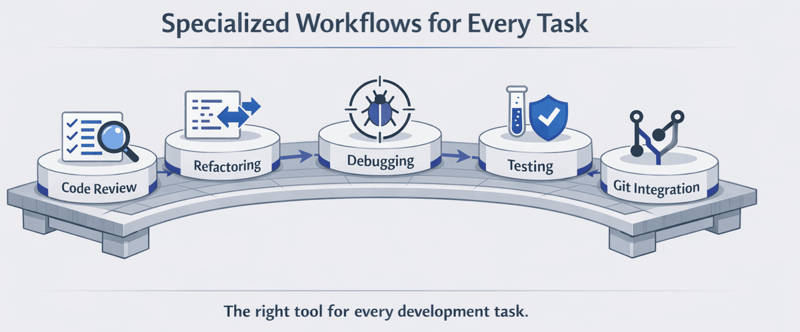

> **AIが、あなたが質問することさえ知らなかったバグを見つけることができたら？**

このチャプターでは、GitHub Copilot CLIがあなたの日常ツールになります。毎日利用するワークフロー（テスト、リファクタリング、デバッグ、Git）の中で使用します。

## 🎯 学習目標

このチャプターを終えるまでに、以下ができるようになります：

- Copilot CLIで包括的なコードレビューを実行する
- 安全にレガシーコードをリファクタリングする
- AI支援でバグをデバッグする
- テストを自動生成する
- Copilot CLIをgitワークフローと統合する

> ⏱️ **所要時間**: 約60分（読む15分 + 実践45分）

---

## 🧩 リアルワールドアナロジー：大工のワークフロー

大工は単にツールの使い方を知っているだけでなく、異なる作業用に*ワークフロー*があります：


同様に、開発者には異なるタスク用のワークフローがあります。GitHub Copilot CLIは各ワークフローを強化し、日常的なコーディングタスクでより効率的かつ効果的にします。

---

# 5つのワークフロー


下記の各ワークフローは独立しています。現在のニーズに合ったものを選択するか、すべて実行してください。

---

## あなたの冒険を選んでください

このチャプターは開発者が一般的に使用する5つのワークフローをカバーしています。**ただし、すべて一度に読む必要はありません！** 各ワークフローは下記の折りたたみセクションに含まれており、自立しています。現在のプロジェクトに合ったものを選択してください。後で他のものを探索に戻ってくることができます。


| 私が希望していること | ジャンプ先 |
|---|---|
| マージ前のコードをレビューする | [Workflow 1: Code Review](#workflow-1-code-review) |
| 厄介なまたはレガシーコードをクリーンアップする | [Workflow 2: Refactoring](#workflow-2-refactoring) |
| バグを追跡して修正する | [Workflow 3: Debugging](#workflow-3-debugging) |
| コード用のテストを生成する | [Workflow 4: Test Generation](#workflow-4-test-generation) |
| より良いコミットとPRを書く | [Workflow 5: Git Integration](#workflow-5-git-integration) |
| コーディング前にリサーチする | [Quick Tip: Research Before You Plan or Code](#quick-tip-research-before-you-plan-or-code) |
| エンドツーエンドのバグ修正ワークフロー全体を見る | [Putting It All Together](#putting-it-all-together-bug-fix-workflow) |

**下記のワークフローを選択して展開し、その領域でGitHub Copilot CLIがあなたの開発プロセスをどのように強化できるかを確認してください。** 

---

<a id="workflow-1-code-review"></a>
<details>
<summary><strong>Workflow 1: Code Review</strong> - ファイルレビュー、/reviewエージェント使用、重大度チェックリスト作成</summary>


### 基本レビュー

この例では、`@`シンボルを使用してファイルを参照し、Copilot CLIにそのコンテンツに直接アクセスさせてレビューします。

```bash
copilot

> Review @samples/book-app-project/book_app.py for code quality
```

---

<details>
<summary>🎬 実際の動作を見る！</summary>


*デモ出力は異なります。あなたのモデル、ツール、応答は以下に表示されるものとは異なります。*

</details>

---

### 入力検証レビュー

Copilot CLIにプロンプトで関心のあるカテゴリを列挙することで、特定の懸念事項（ここでは入力検証）にそのレビューを焦点を絞るよう指示します。

```text
copilot

> Review @samples/book-app-project/utils.py for input validation issues. Check for: missing validation, error handling gaps, and edge cases
```


### クロスファイルプロジェクトレビュー

`@`でディレクトリ全体を参照し、Copilot CLIにプロジェクト内のすべてのファイルを一度にスキャンさせます。

```bash
copilot

> @samples/book-app-project/ Review this entire project. Create a markdown checklist of issues found, categorized by severity
```

### インタラクティブコードレビュー

マルチターン会話を使用してさらに掘り下げます。幅広いレビューから始め、再度開始せずにフォローアップの質問をします。

```bash
copilot

> @samples/book-app-project/book_app.py Review this file for:
> - Input validation
> - Error handling
> - Code style and best practices

# Copilot CLIは詳細なレビューを提供

> The user input handling - are there any edge cases I'm missing?

# Copilot CLIは空の文字列、特殊文字の潜在的な問題を表示

> Create a checklist of all issues found, prioritized by severity

# Copilot CLIは優先度順のアクションアイテムを生成
```

### レビューチェックリストテンプレート

Copilot CLIにその出力を特定の形式（ここで、重大度別のマークダウンチェックリスト）に構造化するよう指示し、イシューに貼り付けることができます。

```bash
copilot

> Review @samples/book-app-project/ and create a markdown checklist of issues found, categorized by:
> - Critical (data loss risks, crashes)
> - High (bugs, incorrect behavior)
> - Medium (performance, maintainability)
> - Low (style, minor improvements)
```

### Gitの変更を理解する（/reviewに重要）

`/review`コマンドを使用する前に、git内で2つのタイプの変更を理解する必要があります：

| 変更タイプ | それが意味するもの | 見方 |
|-------------|---------------|------------|
| **ステージされた変更** | 次のコミットのために`git add`でマークしたファイル | `git diff --staged` |
| **ステージされていない変更** | 変更しましたが、まだ追加していないファイル | `git diff` |

```bash
# クイックリファレンス
git status           # ステージと非ステージの両方を表示
git add file.py      # ファイルをコミット用にステージ
git diff             # ステージされていない変更を表示
git diff --staged    # ステージされた変更を表示
```

### /reviewコマンドを使用する

`/review`コマンドは、ステージされたおよびステージされていない変更を分析するために最適化された組み込み**コードレビューエージェント**を呼び出します。スラッシュコマンドを使用して、フリーフォームプロンプトの代わりに特殊な組み込みエージェントをトリガーします。

```bash
copilot

> /review
# ステージ/ステージされていない変更でコードレビューエージェントを呼び出す
# 焦点を絞った、実行可能なフィードバックを提供

> /review Check for security issues in authentication
# 特定の焦点領域でレビューを実行
```

> 💡 **ヒント**: コードレビューエージェントは、保留中の変更がある場合に最適に機能します。より焦点を絞ったレビューのために`git add`でファイルをステージしてください。

</details>

---

<a id="workflow-2-refactoring"></a>
<details>
<summary><strong>Workflow 2: Refactoring</strong> - コードを再構成、関心事を分離、エラーハンドリングを改善</summary>


### シンプルなリファクタリング

> **最初にこれを試してください：** `@samples/book-app-project/book_app.py The command handling uses if/elif chains. Refactor it to use a dictionary dispatch pattern.`

単純な改善から始めてください。本のアプリでこれらを試してください。各プロンプトは`@`ファイル参照と特定のリファクタリング指示を組み合わせているため、Copilot CLIは何を変更するかを正確に知っています。

```bash
copilot

> @samples/book-app-project/book_app.py The command handling uses if/elif chains. Refactor it to use a dictionary dispatch pattern.

> @samples/book-app-project/utils.py Add type hints to all functions

> @samples/book-app-project/book_app.py Extract the book display logic into utils.py for better separation of concerns
```

> 💡 **リファクタリングが初めてですか？** 複雑な変換に取り組む前に、タイプヒントの追加や変数名の改善など、シンプルなリクエストから始めてください。

---

<details>
<summary>🎬 実際の動作を見る！</summary>


*デモ出力は異なります。あなたのモデル、ツール、応答は以下に表示されるものとは異なります。*

</details>

---

### 関心事の分離

複数のファイルを`@`でシングルプロンプトで参照し、Copilot CLIがリファクタリングの一部としてそれらの間でコードを移動できるようにします。

```bash
copilot

> @samples/book-app-project/utils.py @samples/book-app-project/book_app.py
> The utils.py file has print statements mixed with logic. Refactor to separate display functions from data processing.
```

### エラーハンドリングを改善する

2つの関連ファイルを提供し、横断的な関心事を説明し、Copilot CLIが両方で一貫した修正を提案できるようにします。

```bash
copilot

> @samples/book-app-project/utils.py @samples/book-app-project/books.py
> These files have inconsistent error handling. Suggest a unified approach using custom exceptions.
```

### ドキュメンテーション追加

各ドキュメント文字列に何を含めるべきかを正確に指定するには、詳細な箇条書きリストを使用します。

```bash
copilot

> @samples/book-app-project/books.py Add comprehensive docstrings to all methods:
> - Include parameter types and descriptions
> - Document return values
> - Note any exceptions raised
> - Add usage examples
```

### テストによる安全なリファクタリング

マルチターン会話で2つの関連リクエストをチェーンします。最初にテストを生成し、次にそれらのテストを安全ネットとしてリファクタリングします。

```bash
copilot

> @samples/book-app-project/books.py Before refactoring, generate tests for current behavior

# 最初にテストを取得

> Now refactor the BookCollection class to use a context manager for file operations

# 動作が保持されることを確認するテストで自信を持ってリファクタリング
```

</details>

---

<a id="workflow-3-debugging"></a>
<details>
<summary><strong>Workflow 3: Debugging</strong> - バグを追跡、セキュリティ監査、ファイル間で問題をトレース</summary>


### シンプルなデバッグ

> **最初にこれを試してください：** `@samples/book-app-buggy/books_buggy.py Users report that searching for "The Hobbit" returns no results even though it's in the data. Debug why.`

何が間違っているかを説明することから始めてください。これは、バグのある本のアプリで試すことができるデバッグパターンです。各プロンプトは`@`ファイル参照と明確な症状の説明を組み合わせているため、Copilot CLIはバグを特定して診断できます。

```bash
copilot

# パターン: "Xを期待したが、Yを得ました"
> @samples/book-app-buggy/books_buggy.py Users report that searching for "The Hobbit" returns no results even though it's in the data. Debug why.

# パターン: "予期しない動作"
> @samples/book-app-buggy/book_app_buggy.py When I remove a book that doesn't exist, the app says it was removed. Help me find why.

# パターン: "間違った結果"
> @samples/book-app-buggy/books_buggy.py When I mark one book as read, ALL books get marked. What's the bug?
```

> 💡 **デバッグヒント**: *症状*（あなたが見たもの）と*期待*（何が起こるべきか）を説明してください。Copilot CLIが残りを把握します。

---

<details>
<summary>🎬 実際の動作を見る！</summary>


*デモ出力は異なります。あなたのモデル、ツール、応答は以下に表示されるものとは異なります。*

</details>

---

### "バグ探偵" - AIが関連するバグを見つける

これはコンテキストに対応したデバッグが輝くところです。バグのある本のアプリでこのシナリオを試してください。`@`でファイル全体を提供し、ユーザーが報告した症状のみを説明します。Copilot CLIは根本原因をトレースし、付近の追加のバグを見つけるかもしれません。

```bash
copilot

> @samples/book-app-buggy/books_buggy.py
>
> Users report: "Finding books by author name doesn't work for partial names"
> Debug why this happens
```

**Copilot CLIがすることは**：
```
Root Cause: Line 80 uses exact match (==) instead of partial match (in).

Line 80: return [b for b in self.books if b.author == author]

find_by_author関数は正確なマッチが必要です。"Tolkien"を検索しても
"J.R.R. Tolkien"による本が見つかりません。

Fix: Change to case-insensitive partial match:
return [b for b in self.books if author.lower() in b.author.lower()]
```

**なぜこれが重要か**: Copilot CLIはファイル全体を読み、バグレポートのコンテキストを理解し、明確な説明を伴う特定の修正を与えます。

> 💡 **ボーナス**: Copilot CLIはファイル全体を分析するため、聞かれなかった*他の*問題を見つけることがよくあります。たとえば、作者検索を修正している間、Copilot CLIは`find_book_by_title`の大文字小文字の区別のバグにも気付くかもしれません！

### リアルワールドセキュリティサイドバー

独自のコードをデバッグすることは重要ですが、本番環境アプリケーションのセキュリティ脆弱性を理解することは重要です。このサンプルを試してください：不慣れなファイルにCopilot CLIを指し、セキュリティ問題の監査を依頼します。

```bash
copilot

> @samples/buggy-code/python/user_service.py Find all security vulnerabilities in this Python user service
```

このファイルは、本番環境アプリで見られるリアルワールドセキュリティパターンを示します。

> 💡 **出会うことになる一般的なセキュリティ用語:**
> - **SQL Injection**: ユーザー入力がデータベースクエリに直接入力されるとき、攻撃者が悪意のあるコマンドを実行できる
> - **Parameterized queries**: 安全な代替案 - プレースホルダー（`?`）ユーザーデータをSQLコマンドから分離
> - **Race condition**: 2つの操作が同時に発生し、互いに干渉するとき
> - **XSS (Cross-Site Scripting)**: 攻撃者が悪意のあるスクリプトをウェブページに注入するとき

---

### エラーを理解する

スタックトレースを直接プロンプトに貼り付け、`@`ファイル参照を入れて、Copilot CLIがエラーをソースコードにマッピングできるようにします。

```bash
copilot

> I'm getting this error:
> AttributeError: 'NoneType' object has no attribute 'title'
>     at show_books (book_app.py:19)
>
> @samples/book-app-project/book_app.py Explain why and how to fix it
```

### テストケースを使用したデバッグ

正確な入力と観察された出力を説明して、Copilot CLIに推論できるコンクリートで再現可能なテストケースを与えます。

```bash
copilot

> @samples/book-app-buggy/books_buggy.py The remove_book function has a bug. When I try to remove "Dune",
> it also removes "Dune Messiah". Debug this: explain the root cause and provide a fix.
```

### コード全体で問題をトレース

複数のファイルを参照し、Copilot CLIにデータフローをトレースして問題がどこから始まるかを特定するよう依頼します。

```bash
copilot

> Users report that the book list numbering starts at 0 instead of 1.
> @samples/book-app-buggy/book_app_buggy.py @samples/book-app-buggy/books_buggy.py
> Trace through the list display flow and identify where the issue occurs
```

### データの問題を理解する

コードが読み込むデータファイルを含めて、Copilot CLIがエラーハンドリング改善を提案するときに全体像を理解できるようにします。

```bash
copilot

> @samples/book-app-project/data.json @samples/book-app-project/books.py
> Sometimes the JSON file gets corrupted and the app crashes. How should we handle this gracefully?
```

</details>

---

<a id="workflow-4-test-generation"></a>
<details>
<summary><strong>Workflow 4: Test Generation</strong> - 包括的なテストとエッジケースを自動生成</summary>


> **最初にこれを試してください：** `@samples/book-app-project/books.py Generate pytest tests for all functions including edge cases`

### "テスト爆発" - 2テストvs15 +テスト

手動でテストを書く場合、開発者は通常2〜3の基本的なテストを作成します：
- 有効な入力をテスト
- 無効な入力をテスト
- エッジケースをテスト

Copilot CLIに包括的なテストを生成するよう依頼するとどうなるかを見てください。このプロンプトは構造化された箇条書きリストを`@`ファイル参照と共に使用して、徹底的なテストカバレッジに向かってCopilot CLIをガイドします：

```bash
copilot

> @samples/book-app-project/books.py Generate comprehensive pytest tests. Include tests for:
> - Adding books
> - Removing books
> - Finding by title
> - Finding by author
> - Marking as read
> - Edge cases with empty data
```

---

<details>
<summary>🎬 実際の動作を見る！</summary>


*デモ出力は異なります。あなたのモデル、ツール、応答は以下に表示されるものとは異なります。*

</details>

---

**あなたが得られるもの**: 以下を含む15以上の包括的なテスト：

```python
class TestBookCollection:
    # Happy path
    def test_add_book_creates_new_book(self):
        ...
    def test_list_books_returns_all_books(self):
        ...

    # Find operations
    def test_find_book_by_title_case_insensitive(self):
        ...
    def test_find_book_by_title_returns_none_when_not_found(self):
        ...
    def test_find_by_author_partial_match(self):
        ...
    def test_find_by_author_case_insensitive(self):
        ...

    # Edge cases
    def test_add_book_with_empty_title(self):
        ...
    def test_remove_nonexistent_book(self):
        ...
    def test_mark_as_read_nonexistent_book(self):
        ...

    # Data persistence
    def test_save_books_persists_to_json(self):
        ...
    def test_load_books_handles_missing_file(self):
        ...
    def test_load_books_handles_corrupted_json(self):
        ...

    # Special characters
    def test_add_book_with_unicode_characters(self):
        ...
    def test_find_by_author_with_special_characters(self):
        ...
```

**結果**: 30秒で、考えて書くのに1時間かかるエッジケーステストを取得します。

---

### ユニットテスト

単一の関数をターゲットにし、テストしたい入力カテゴリを列挙し、Copilot CLIが焦点を絞った、徹底的なユニットテストを生成できるようにします。

```bash
copilot

> @samples/book-app-project/utils.py Generate comprehensive pytest tests for get_book_details covering:
> - Valid input
> - Empty strings
> - Invalid year formats
> - Very long titles
> - Special characters in author names
```

### テストを実行する

ツールチェーンについてCopilot CLIに平文の質問をしてください。正しいシェルコマンドを生成できます。

```bash
copilot

> How do I run the tests? Show me the pytest command.

# Copilot CLIが応答：
# cd samples/book-app-project && python -m pytest tests/
# または詳細出力の場合: python -m pytest tests/ -v
# プリント文を表示するには: python -m pytest tests/ -s
```

### 特定のシナリオのテスト

高度なまたはトリッキーなシナリオをリストして、Copilot CLIがhappy pathを超えるようにします。

```bash
copilot

> @samples/book-app-project/books.py Generate tests for these scenarios:
> - Adding duplicate books (same title and author)
> - Removing a book by partial title match
> - Finding books when collection is empty
> - File permission errors during save
> - Concurrent access to the book collection
```

### 既存ファイルにテストを追加

単一の関数の*追加*テストを依頼し、Copilot CLIが既に持っているものを補完する新しいケースを生成させます。

```bash
copilot

> @samples/book-app-project/books.py
> Generate additional tests for the find_by_author function with edge cases:
> - Author name with hyphens (e.g., "Jean-Paul Sartre")
> - Author with multiple first names
> - Empty string as author
> - Author name with accented characters
```

</details>

---

<a id="workflow-5-git-integration"></a>
<details>
<summary><strong>Workflow 5: Git Integration</strong> - コミットメッセージ、PR説明、/pr、/delegate、/diff</summary>


> 💡 **このワークフローは基本的なgit知識を前提としています**（ステージング、コミット、ブランチ）。Gitが初めてなら、最初に他の4つのワークフローを試してください。

### コミットメッセージを生成する

> **最初にこれを試してください：** `copilot -p "Generate a conventional commit message for: $(git diff --staged)"` — いくつかの変更をステージしてから、これを実行して、Copilot CLIがコミットメッセージを書くのを見てください。

この例では、`-p`インラインプロントフラグをシェルコマンド置換と一緒に使用して、`git diff`出力を直接Copilot CLIにパイプしてワンショットコミットメッセージを付けます。`$(...)` 構文は括弧内のコマンドを実行し、その出力を外側のコマンドに挿入します。

```bash

# 変更内容を表示
git diff --staged

# コミットメッセージを生成する[Conventional Commit](../GLOSSARY.md#conventional-commit)フォーマット
# （"feat(books): add search"または"fix(data): handle empty input"などの構造化されたメッセージ）
copilot -p "Generate a conventional commit message for: $(git diff --staged)"

# 出力: "feat(books): add partial author name search
#
# - Update find_by_author to support partial matches
# - Add case-insensitive comparison
# - Improve user experience when searching authors"
```

---

<details>
<summary>🎬 実際の動作を見る！</summary>


*デモ出力は異なります。あなたのモデル、ツール、応答は以下に表示されるものとは異なります。*

</details>

---

### 変更を説明する

`git show`の出力をパイプして`-p`プロンプトに、最後のコミットの平文サマリーを取得します。

```bash
# このコミットは何を変更しましたか？
copilot -p "Explain what this commit does: $(git show HEAD --stat)"
```

### PR説明

`git log`出力を構造化されたプロンプトテンプレートと組み合わせて、完全なプルリクエスト説明を自動生成します。

```bash
# ブランチ変更からPR説明を生成
copilot -p "Generate a pull request description for these changes:
$(git log main..HEAD --oneline)

Include:
- Summary of changes
- Why these changes were made
- Testing done
- Breaking changes? (yes/no)"
```

### インタラクティブモードで/prを使用する現在のブランチ

Copilot CLIのインタラクティブモードでブランチを操作している場合、`/pr`コマンドを使用してプルリクエストを操作できます。`/pr`を使用してPRを表示、新しいPRを作成、既存のPRを修正、またはCopilot CLIにブランチの状態に基づいて自動的に判断させることができます。

```bash
copilot

> /pr [view|create|fix|auto]
```

### 推す前にレビューする

ブランチ内の変更全体をクイック事前プッシュの健全性チェックとして`git diff main..HEAD`を`-p`プロンプト内で使用します。

```bash
# 推す前の最後のチェック
copilot -p "Review these changes for issues before I push:
$(git diff main..HEAD)"
```

### /delegateを背景タスクに使用する

`/delegate`コマンドはGitHub Copilot ClIクラウドエージェントに作業を渡します。`/delegate`スラッシュコマンド（または`&`ショートカット）を使用して、明確に定義されたタスクをバックグラウンドエージェントにオフロードします。

```bash
copilot

> /delegate Add input validation to the login form

# または&プリフィックスショートカットを使用：
> & Fix the typo in the README header

# Copilot CLI：
# 1. 変更を新しいブランチにコミット
# 2. ドラフトプルリクエストを開く
# 3. バックグラウンドでGitHubで作業
# 4. 完了時にレビューをリクエスト
```

これは、他の作業に焦点を当てている間に完了する明確に定義されたタスクに最適です。

### /diffを使用してセッション変更をレビュー

`/diff`コマンドは現在のセッション中に行われたすべての変更を表示します。このスラッシュコマンドを使用して、コミットする前にCopilot CLIが変更したすべてのファイルの視覚的な差分を表示します。

```bash
copilot

# いくつかの変更を加えた後...
> /diff

# このセッションで変更されたすべてのファイルの視覚的な差分を表示
# コミット前にレビューするのに最適
```

</details>

---

## クイックチップ：コーディングの前に研究する

ライブラリを調査する必要がある場合、ベストプラクティスを理解する場合、または不慣れなトピックを探索する場合は、`/research`を使用して、コードを書く前に深いリサーチ調査を実行します：

```bash
copilot

> /research What are the best Python libraries for validating user input in CLI apps?
```

Copilot CLIはGitHubリポジトリとWebソースを検索し、参照を含む概要を返します。これは、新しい機能を開始する準備ができており、最初に情報に基づいた決定を行いたい場合に便利です。`/share`を使用して結果を共有できます。

> 💡 **ヒント**: `/research`は`/plan`の*前に*うまく機能します。アプローチを研究してから、実装を計画してください。

---

## まとめ：バグ修正ワークフロー

報告されたバグを修正するための完全なワークフローは次のとおりです：

```bash

# 1. バグレポートを理解する
copilot

> Users report: 'Finding books by author name doesn't work for partial names'
> @samples/book-app-project/books.py Analyze and identify the likely cause

# 2. 問題をデバッグ（同じセッションで続行）
> Based on the analysis, show me the find_by_author function and explain the issue

> Fix the find_by_author function to handle partial name matches

# 3. 修正用テストを生成
> @samples/book-app-project/books.py Generate pytest tests specifically for:
> - Full author name match
> - Partial author name match
> - Case-insensitive matching
> - Author name not found

# 4. コミットメッセージを生成
copilot -p "Generate commit message for: $(git diff --staged)"

# 出力: "fix(books): support partial author name search"
```

### バグ修正ワークフロー概要

| ステップ | アクション | Copilotコマンド |
|------|--------|-----------------|
| 1 | バグを理解 | `> [describe bug] @relevant-file.py Analyze the likely cause` |
| 2 | 詳細な分析を取得 | `> Show me the function and explain the issue` |
| 3 | 修正を実装 | `> Fix the [specific issue]` |
| 4 | テストを生成 | `> Generate tests for [specific scenarios]` |
| 5 | コミット | `copilot -p "Generate commit message for: $(git diff --staged)"` |

---

# 練習


これでこれらのワークフローを適用する番です。

---

## ▶️ 自分で試してください

デモを完了した後、これらのバリエーションを試してください：

1. **バグ探偵チャレンジ**: Copilot CLIに`samples/book-app-buggy/books_buggy.py`の`mark_as_read`関数をデバッグするよう依頼してください。すべての本をマークする代わりに、1つだけマークする理由をなぜ説明しましたか？

2. **テストチャレンジ**: 本のアプリの`add_book`関数用のテストを生成します。Copilot CLIが含むエッジケースの数を数えます。思いついていないでしょう。

3. **コミットメッセージチャレンジ**: 本のアプリファイルに小さな変更を加え、それをステージし（`git add .`）、次を実行します：
   ```bash
   copilot -p "Generate a conventional commit message for: $(git diff --staged)"
   ```
   メッセージは、すばやく書いていたものより良いですか？

**自己確認**: 開発ワークフローを理解しているとき、"Find bugs"より"debug this bug"が強力な理由を説明できます（コンテキストは重要です！）。

---

## 📝 割り当て

### メインチャレンジ：リファクタリング、テスト、および配布

実践例は`find_book_by_title`とコードレビューに焦点を当てていました。今度は`book-app-project`の異なる関数で同じワークフロースキルを練習します：

1. **レビュー**: Copilot CLIに`books.py`の`remove_book()`エッジケースと潜在的な問題についてレビューするよう依頼してください：
   `@samples/book-app-project/books.py Review the remove_book() function. What happens if the title partially matches another book (e.g., "Dune" vs "Dune Messiah")? Are there any edge cases not handled?`
2. **リファクタリング**: Copilot CLIに`remove_book()`を改善して、大文字と小文字が区別されないマッチングなどのエッジケースを処理し、本が見つからない場合に有用なフィードバックを返すよう依頼してください
3. **テスト**: 改善された`remove_book()`関数のpytestテストを生成し、以下をカバーしています：
    - 存在する本を削除する
    - 大文字小文字を区別しないタイトルマッチング
    - 見つからない本は適切なフィードバックを返します
    - 空のコレクションから削除
4. **レビュー**: 変更をステージし、`/review`を実行して、残っている問題をチェックします
5. **コミット**: 従来のコミットメッセージを生成します：
   `copilot -p "Generate a conventional commit message for: $(git diff --staged)"`

<details>
<summary>💡 ヒント（展開するには）</summary>

**各ステップのサンプルプロンプト：**

```bash
copilot

# Step 1: Review
> @samples/book-app-project/books.py Review the remove_book() function. What edge cases are not handled?

# Step 2: Refactor
> Improve remove_book() to use case-insensitive matching and return a clear message when the book isn't found. Show me the before and after code.

# Step 3: Test
> Generate pytest tests for the improved remove_book() function, including:
> - Removing a book that exists
> - Case-insensitive matching ("dune" should remove "Dune")
> - Book not found returns appropriate response
> - Removing from an empty collection

# Step 4: Review
> /review

# Step 5: Commit
> Generate a conventional commit message for this refactor
```

**ヒント：** `remove_book()`を改善した後、Copilot CLIに「このファイルの他の関数が同じ改善から利益を得ることができますか？」と依頼してください。`find_book_by_title()`または`find_by_author()`と同様の変更を提案するかもしれません。

</details>

### ボーナスチャレンジ：Copilot CLIでアプリケーションを作成します

> 💡 **注意**: このGitHub Skillsエクササイズは、Pythonではなく**Node.js**を使用します。あなたが練習するGitHub Copilot CLIテクニック - 問題の作成、コードの生成、ターミナルからのコラボレーション - あらゆる言語に適用されます。

このエクササイズでは、GitHub Copilot CLIを使用して、Node.js計算機アプリを構築しながら、問題を作成、コードを生成、ターミナルからコラボレーションする方法を開発者に示します。CLIをインストールし、テンプレートとエージェントを使用し、反復的なコマンドラインドリブン開発を練習します。

#####  [「Copilot CLIでアプリケーションを作成する」スキルエクササイズを開始してください](https://github.com/skills/create-applications-with-the-copilot-cli)

---

<details>
<summary>🔧 <strong>一般的な間違いと トラブルシューティング</strong>（展開するには）</summary>

### 一般的な間違い

| 間違い | 何が起こるか | 修正 |
|---------|--------------|-----|
| 「このコードをレビュー」のような曖昧なプロンプトを使用する | 特定の問題を見落とす一般的なフィードバック | 「SQL injection、XSS、およびauth問題を確認」など、具体的に指定してください |
| コードレビューに`/review`を使用しない | 最適化されたコードレビューエージェントを逃す | `/review`を使用してください。これは高信号対ノイズ出力のために調整されています |
| コンテキストなしで「バグを見つける」よう依頼 | Copilot CLIはあなたが経験しているバグを知らない | 症状を説明してください：「ユーザーレポートXはYが発生したとき」 |
| フレームワークを指定せずテストを生成 | テストは間違った構文またはアサーションライブラリを使用する可能性があります | 「Jestを使用したテストを生成」または「pytestを使用」を指定してください |

### トラブルシューティング

**レビューが不完全に見える** - 見るべきものについて、より具体的にしてください：

```bash
copilot

# 代わりに：
> Review @samples/book-app-project/book_app.py

# 試してください：
> Review @samples/book-app-project/book_app.py for input validation, error handling, and edge cases
```

**テストが私のフレームワークと一致しません** - フレームワークを指定してください：

```bash
copilot

> @samples/book-app-project/books.py Generate tests using pytest (not unittest)
```

**リファクタリングは動作を変更します** - Copilot CLIに動作を保存するよう依頼してください：

```bash
copilot

> @samples/book-app-project/book_app.py Refactor command handling to use dictionary dispatch. IMPORTANT: Maintain identical external behavior - no breaking changes
```

</details>

---

# 概要

## 🔑 重要なポイント



1. **コードレビュー**は特定のプロンプトでより包括的になります
2. **リファクタリング**テストを最初に生成したとき、より安全です
3. **デバッグ**はCopilot CLIにエラーと*コードの両方を表示するからメリットを得ます
4. **テスト生成**はエッジケースとエラーシナリオを含める必要があります
5. **Gitエントグレーション**は、コミットメッセージとPR説明を自動化します

> 📋 **クイックリファレンス**: [GitHub Copilot CLIコマンドリファレンス](https://docs.github.com/en/copilot/reference/cli-command-reference)を参照して、コマンドとショートカットの完全なリストを見てください。

---

## ✅ チェックポイント：必需品をマスターしました

**おめでとうございます！** これでGitHub Copilot CLIで生産性が高い人になるための主要なスキルをすべて習得しました：

| スキル | チャプター | これでできることは... |
|-------|---------|----------------|
| 基本的なコマンド | Ch 01 | インタラクティブモード、計画モード、プログラム的モード（-p）、およびスラッシュコマンドを使用 |
| コンテキスト | Ch 02 | `@`でファイルを参照し、セッションを管理し、コンテキストウィンドウを理解 |
| ワークフロー | Ch 03 | コードをレビュー、リファクタリング、デバッグ、テストを生成、gitと統合 |

チャプター04～06は、さらに多くの力を追加し、学習する価値がある追加機能をカバーしています。

---

## 🛠️ パーソナルワークフローの構築

GitHub Copilot CLIを使用する「正しい」方法は1つではありません。ここにあなた自身のパターンを開発するときのいくつかのヒントがあります：

> 📚 **公式ドキュメント**: [Copilot CLIベストプラクティス](https://docs.github.com/copilot/how-tos/copilot-cli/cli-best-practices) GitHubからの推奨ワークフローとヒント。

- **非些細なすべてで`/plan`から始めます。** 実行前に計画を絞り込む - 良い計画はより良い結果につながります。
- **よく機能するプロンプトを保存してください。** Copilot CLIが誤字を起こした場合、何が間違っていたかに注目してください。時間の経過とともに、これはあなたの個人的な遊び本になります。
- **自由に実験してください。** 一部の開発者は長く、詳細なプロンプトを好みます。その他は短いプロンプトとフォローアップを好みます。さまざまなアプローチを試し、自然に感じるものに注目してください。

> 💡 **今後**: 第04および05章では、Copilot CLIが自動的に読み込むカスタム指示とスキルにベストプラクティスを符号化する方法を学ぶ

---

## ➡️ 次は何ですか

残りのチャプターは、Copilot CLIの機能を拡張する追加機能をカバーしています：

| チャプター | カバーしている内容 | 必要になるのはいつ |
|---------|----------------|---------------------|
| Ch 04: Agents | 特化したAIペルソナを作成 | ドメインの専門家（フロントエンド、セキュリティ）が必要な場合 |
| Ch 05: Skills | タスク用の自動ロード指示 | 同じプロンプトをよく繰り返す場合 |
| Ch 06: MCP | 外部サービスを接続 | GitHub、データベースなどからのライブデータが必要な場合 |

**推奨**: コアワークフローを1週間試して、特定のニーズがあるときに第04～06章に戻ってください。

---

## 追加トピックに続く

**[Chapter 04: Agents and Custom Instructions](../04-agents-custom-instructions/README.md)**では、以下について学習します：

- 組み込みエージェント（`/plan`、`/review`）を使用する
- 特化したエージェント（フロントエンドエキスパート、セキュリティ監査人）を`.agent.md`ファイルで作成
- マルチエージェント協力パターン
- プロジェクト標準用のカスタム指示ファイル

---

**[← Chapter 02に戻る](../02-context-conversations/README.md)** | **[Chapter 04に続く →](../04-agents-custom-instructions/README.md)**
