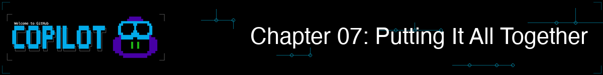
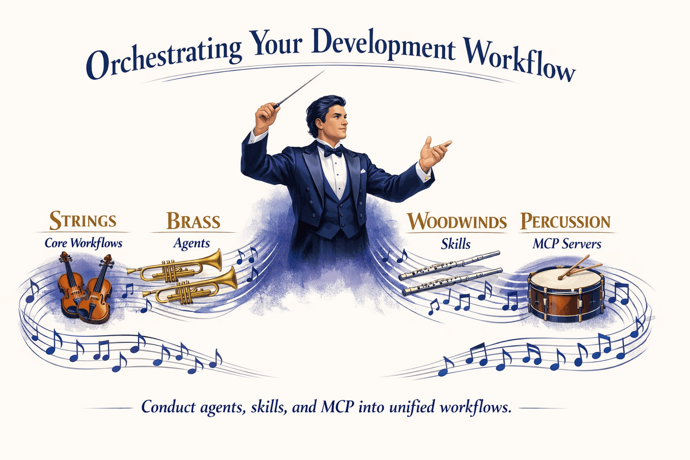

> **学んだすべてがここで結びつきます。アイデアからマージされたPRまで、1つのセッションで完成させます。**

このチャプターでは、これまで学んだすべてのことを実践的なワークフローに統合します。複数エージェントの協働を使用した機能の構築、コミット前にセキュリティ問題をキャッチするpre-commit hookの設定、CI/CDパイプラインへの Copilot の統合、そして機能のアイデアからマージされたPRまでを1つの terminal セッションで実現することを学びます。ここが GitHub Copilot CLI が本当の force multiplier になるところです。

> 💡 **注**: このチャプターは、学んだすべてのことを組み合わせる方法を示しています。**productive になるために agents、skills、MCP が必須ではありません（ただし非常に便利です）。** コア ワークフロー — describe、plan、implement、test、review、ship — は Chapters 00-03 の built-in 機能だけで動作します。

## 🎯 学習目標

このチャプターの終わりには、以下ができるようになります：

- agents、skills、MCP (Model Context Protocol) を統一されたワークフローに統合する
- 複数ツールアプローチを使用した完全な機能の構築
- hooks による基本的な自動化の設定
- プロフェッショナルな開発のベストプラクティスの適用

> ⏱️ **推定時間**: 約75分（読む15分 + ハンズオン60分）

---

## 🧩 現実的な類似表現：オーケストラ



シンフォニーオーケストラは多くのセクションを持ちます：
- **String（弦楽器）** は基礎を提供します（あなたのコア ワークフローのように）
- **Brass（金管楽器）** はパワーを追加します（specialized expertise を持つ agents のように）
- **Woodwind（木管楽器）** は色を追加します（capabilities を拡張する skills のように）
- **Percussion（打楽器）** はリズムを保ちます（external システムに接続する MCP のように）

個別には、各セクションの音は限定的です。うまく指揮されると、一緒になって素晴らしいものが生まれます。

**これがこのチャプターが教えることです！**<br>
*オーケストラの指揮者のように、agents、skills、MCP を統一されたワークフローに編成する*

まず、コードを変更し、テストを生成し、レビューし、PRを作成する — すべて1つのセッションで行うシナリオを見ていきましょう。

---

## 1つのセッションでアイデアからマージされたPRへ

editor、terminal、test runner、GitHub UI の間を切り替えるたびにコンテキストを失う代わりに、1つの terminal セッションですべてのツールを統合できます。このパターンを [統合パターン](#統合パターン-パワーユーザー向け) セクションで分解していきます。

```bash
# Copilot をインタラクティブモードで開始
copilot

> I need to add a "list unread" command to the book app that shows only
> books where read is False. What files need to change?

# Copilot が高レベルプランを作成します...

# SWITCH TO PYTHON-REVIEWER AGENT
> /agent
# Select "python-reviewer"

> @samples/book-app-project/books.py Design a get_unread_books method.
> What is the best approach?

# Python-reviewer agent が以下を生成します：
# - Method signature と return type
# - list comprehension を使用した filter の実装
# - 空のコレクションのedge case 処理

# SWITCH TO PYTEST-HELPER AGENT
> /agent
# Select "pytest-helper"

> @samples/book-app-project/tests/test_books.py Design test cases for
> filtering unread books.

# Pytest-helper agent が以下を生成します：
# - 空のコレクションのテストケース
# - 読んだ/読んでいない本が混在するテストケース
# - すべての本が読まれたテストケース

# IMPLEMENT
> Add a get_unread_books method to BookCollection in books.py
> Add a "list unread" command option in book_app.py
> Update the help text in the show_help function

# TEST
> Generate comprehensive tests for the new feature

# 以下のような複数のテストが生成されます：
# - Happy path（3つのテスト）— 正しくフィルタ、読んだものを除外、読んでないものを含める
# - Edge case（4つのテスト）— 空のコレクション、すべて読んだ、何も読んでない、単一の本
# - Parametrized（5ケース）— @pytest.mark.parametrize 経由の様々な読んだ/読んでない比率
# - Integration（4つのテスト）— mark_as_read、remove_book、add_book との相互作用、データ整合性

# 変更をレビュー
> /review

# レビューが通った場合、/pr を使用して現在のブランチのpull request を操作
> /pr [view|create|fix|auto]

# または、terminal から Copilot にドラフト作成させたい場合は自然に聞く
> Create a pull request titled "Feature: Add list unread books command"
```

**従来のアプローチ**: editor、terminal、test runner、docs、GitHub UI の間を切り替え。各切り替えはコンテキスト喪失と摩擦を引き起こします。

**重要な洞察**: architect のような specialist に指示を出しました。彼らは詳細を処理しました。あなたは vision を処理しました。

> 💡 **さらに進む**: このような大規模な複数ステップのプランの場合、`/fleet` を試して Copilot に独立したサブタスクを並行して実行させます。詳細は [公式ドキュメント](https://docs.github.com/copilot/concepts/agents/copilot-cli/fleet) を参照してください。

---

# 追加のワークフロー


Chapters 04-06 を完了した power users 向けに、これらのワークフローは agents、skills、MCP がどのように effectiveness を乗算するかを示します。

## 統合パターン — パワーユーザー向け

すべてを統合するための mental model は次の通りです：


---

## ワークフロー1：バグ調査と修正

完全なツール統合を使用した現実的なバグ修正：

```bash
copilot

# PHASE 1: GitHub からバグの詳細を理解（MCP が提供）
> Get the details of issue #1

# 学ぶ："find_by_author doesn't work with partial names"

# PHASE 2: ベストプラクティスを調査（web + GitHub source による深い調査）
> /research Best practices for Python case-insensitive string matching

# PHASE 3: 関連コードを検索
> @samples/book-app-project/books.py Show me the find_by_author method

# PHASE 4: エキスパート分析を取得
> /agent
# Select "python-reviewer"

> Analyze this method for issues with partial name matching

# Agent が特定：Method は partial name matching の代わりに exact equality を使用

# PHASE 5: agent のガイダンスで修正
> Implement the fix using lowercase comparison and 'in' operator

# PHASE 6: テストを生成
> /agent
# Select "pytest-helper"

> Generate pytest tests for find_by_author with partial matches
> Include test cases: partial name, case variations, no matches

# PHASE 7: Commit と PR
> Generate a commit message for this fix

> Create a pull request linking to issue #1
```

---

## ワークフロー2：コードレビューの自動化（オプション）

> 💡 **このセクションはオプションです。** Pre-commit hook は teams 向けに便利ですが、productive になるために必須ではありません。スタートしたばかりの場合は、これをスキップしてください。
>
> ⚠️ **パフォーマンス注：** この hook は staged ファイルごとに `copilot -p` を呼び出すため、ファイルあたり数秒かかります。大規模な commit の場合は、重要なファイルに制限するか、代わりに `/review` で manually にレビューを実行することを検討してください。

**git hook** は Git が自動的に特定のポイント（例：commit 直前）で実行するスクリプトです。これを使用して、コードに対する自動チェックを実行できます。次は、commit に対する自動 Copilot レビューを設定する方法です：

```bash
# pre-commit hook を作成
cat > .git/hooks/pre-commit << 'EOF'
#!/bin/bash

# Staged ファイルを取得（Python ファイルのみ）
STAGED=$(git diff --cached --name-only --diff-filter=ACM | grep -E '\.py$')

if [ -n "$STAGED" ]; then
  echo "Running Copilot review on staged files..."

  for file in $STAGED; do
    echo "Reviewing $file..."

    # timeout を使用してハング を防止（ファイルあたり60秒）
    # --allow-all は file reads/writes を auto-approve するため、hook が unattended で実行可能。
    # automated script でのみこれを使用。interactive session では Copilot に permission を求める。
    REVIEW=$(timeout 60 copilot --allow-all -p "Quick security review of @$file - critical issues only" 2>/dev/null)

    # timeout が発生した場合を確認
    if [ $? -eq 124 ]; then
      echo "Warning: Review timed out for $file (skipping)"
      continue
    fi

    if echo "$REVIEW" | grep -qi "CRITICAL"; then
      echo "Critical issues found in $file:"
      echo "$REVIEW"
      exit 1
    fi
  done

  echo "Review passed"
fi
EOF

chmod +x .git/hooks/pre-commit
```

> ⚠️ **macOS ユーザー**: `timeout` コマンドは macOS では default に含まれていません。`brew install coreutils` でインストールするか、`timeout 60` を timeout guard なしの単純な呼び出しに置き換えます。

> 📚 **公式ドキュメント**: [Use hooks](https://docs.github.com/copilot/how-tos/copilot-cli/use-hooks) と [Hooks configuration reference](https://docs.github.com/copilot/reference/hooks-configuration) で完全な hooks API を参照。
>
> 💡 **Built-in 代替案**: Copilot CLI には、pre-commit のようなイベントで自動的に実行できる built-in hooks システム（`copilot hooks`）もあります。上記の manual git hook は完全な control を提供し、built-in system はより単純な configuration です。どちらのアプローチがワークフローに適切かを決定するには、上記の docs を参照してください。

今すべての commit は quick security review を取得します：

```bash
git add samples/book-app-project/books.py
git commit -m "Update book collection methods"

# Output:
# Running Copilot review on staged files...
# Reviewing samples/book-app-project/books.py...
# Critical issues found in samples/book-app-project/books.py:
# - Line 15: File path injection vulnerability in load_from_file
#
# Fix the issue and try again.
```

---

## ワークフロー3：新しいコードベースへのオンボーディング

新しいプロジェクトに参加するとき、context、agents、MCP を組み合わせて迅速にランプアップできます：

```bash
# Copilot をインタラクティブモードで開始
copilot

# PHASE 1: Context で big picture を取得
> @samples/book-app-project/ Explain the high-level architecture of this codebase

# PHASE 2: 特定のフローを理解
> @samples/book-app-project/book_app.py Walk me through what happens
> when a user runs "python book_app.py add"

# PHASE 3: Agent でエキスパート分析を取得
> /agent
# Select "python-reviewer"

> @samples/book-app-project/books.py Are there any design issues,
> missing error handling, or improvements you would recommend?

# PHASE 4: 何かを見つける（MCP が GitHub access を提供）
> List open issues labeled "good first issue"

# PHASE 5: 貢献を開始
> Pick the simplest open issue and outline a plan to fix it
```

このワークフローは `@` context、agents、MCP を1つの onboarding セッションに統合し、このチャプターの earlier に示された統合パターンと全く同じです。

---

# ベストプラクティス＆自動化

ワークフローをより効果的にするパターンと習慣。

---

## ベストプラクティス

### 1. 分析前に Context を集める

分析を求める前に常に context を集めます：

```bash
# Good
> Get the details of issue #42
> /agent
# Select python-reviewer
> Analyze this issue

# Less effective
> /agent
# Select python-reviewer
> Fix login bug
# Agent は issue context を持たない
```

### 2. 違いを知る：Agents、Skills、Custom Instructions

各ツールは sweet spot を持ちます：

```bash
# Agents: Explicit に activate する specialized personas
> /agent
# Select python-reviewer
> Review this authentication code for security issues

# Skills: あなたの prompt が skill の description にマッチしたときに
# auto-activate する modular capabilities（最初に作成する必要があります — Ch 05 を参照）
> Generate comprehensive tests for this code
# configured した testing skill がある場合、自動的に activate します

# Custom instructions (.github/copilot-instructions.md): Always-on
# guidance で、切り替えやトリガーなしで each session に適用
```

> 💡 **重要なポイント**: Agents と skills は両方ともコードを分析と生成できます。実際の違いは **どのように activate するか** — agents は explicit（`/agent`）、skills は automatic（prompt-matched）、custom instructions は always on。

### 3. セッションを Focused に保つ

`/rename` を使用してセッションにラベルを付け（history で見つけやすくする）、`/exit` で cleanly に終了させます：

```bash
# Good: 1つの機能ごとに1つのセッション
> /rename list-unread-feature
# list unread で作業
> /exit

copilot
> /rename export-csv-feature
# CSV export で作業
> /exit

# Less effective: すべてを1つの long セッションに入れる
```

### 4. Copilot でワークフローを再利用可能にする

ワークフローを wiki に文書化するだけでなく、Copilot が使用できるように repo に直接 encode します：

- **Custom instructions** (`.github/copilot-instructions.md`): coding standards、architecture rules、build/test/deploy steps のための always-on guidance。すべてのセッションが自動的に従います。
- **Prompt files** (`.github/prompts/`): チームが共有できる reusable、parameterized prompt — code review、component generation、PR descriptions のテンプレートのように。
- **Custom agents** (`.github/agents/`): specialized personas（例えば、security reviewer や docs writer）を encode して、チームの誰もが `/agent` で activate できます。
- **Custom skills** (`.github/skills/`): step-by-step workflow の instructions をパッケージ化して、関連する場合に auto-activate します。

> 💡 **ペイオフ**: 新しいチームメンバーはあなたのワークフローを無料で取得 — repo に built-in で、誰かの head に locked in ではなく。

---

## ボーナス：Production パターン

これらのパターンはオプションですが、professional な環境では valuable です。

### PR Description ジェネレーター

```bash
# 包括的な PR descriptions を生成
BRANCH=$(git branch --show-current)
COMMITS=$(git log main..$BRANCH --oneline)

copilot -p "Generate a PR description for:
Branch: $BRANCH
Commits:
$COMMITS

Include: Summary, Changes Made, Testing Done, Screenshots Needed"
```

### CI/CD 統合

既存の CI/CD pipeline を持つチームの場合、GitHub Actions を使用して each pull request で Copilot reviews を自動化できます。これには review comments を自動的に post し、critical issues に対してフィルタすることが含まれます。

> 📖 **詳しく学ぶ**: 完全な GitHub Actions workflows、configuration オプション、troubleshooting tips については [CI/CD Integration](../appendices/ci-cd-integration.md) を参照。

---

# Practice


完全なワークフローを practice に導きます。

---

## ▶️ 自分で試す

demos を完了した後、これらの variations を試してください：

1. **End-to-End Challenge**: 小さな機能を選択（例："list unread books" または "export to CSV"）。完全なワークフローを使用：
   - `/plan` で計画
   - agents（python-reviewer、pytest-helper）で design
   - 実装
   - テスト生成
   - PR を作成

2. **Automation Challenge**: Code Review Automation ワークフローから pre-commit hook を設定。intentional file path vulnerability で commit を作成。ブロックされますか？

3. **あなたの Production ワークフロー**: あなたが行う common task のために独自のワークフローを design。checklist として書き込みます。どの parts が skills、agents、または hooks で自動化できますか？

**Self-Check**: agent、skills、MCP がどのように連動するか、そしていつ各々を使用するかを colleague に説明できるとき、コースが完了します。

---

## 📝 Assignment

### Main Challenge：End-to-End 機能

hands-on examples は "list unread books" 機能の構築を通して見ていきました。今、異なる機能で完全なワークフローを practice してください：**year range で本を検索**：

1. Copilot を開始して context を集める：`@samples/book-app-project/books.py`
2. `/plan Add a "search by year" command that lets users find books published between two years` で計画
3. `BookCollection` に `find_by_year_range(start_year, end_year)` method を実装
4. `book_app.py` に `handle_search_year()` function を追加して、ユーザーに start と end years をプロンプト
5. テストを生成：`@samples/book-app-project/books.py @samples/book-app-project/tests/test_books.py Generate tests for find_by_year_range() including edge cases like invalid years, reversed range, and no results.`
6. `/review` でレビュー
7. README を更新：`@samples/book-app-project/README.md Add documentation for the new "search by year" command.`
8. commit message を生成

進むにつれてワークフローを document。

**Success criteria**: Copilot CLI を使用して、計画、実装、テスト、documentation、review を含めた、アイデアから commit までの機能を完了。

> 💡 **ボーナス**: Chapter 04 から agents がセットアップされている場合、custom agents を作成して使用してみてください。例えば、implementation review のための error-handler agent と README update のための doc-writer agent。

<details>
<summary>💡 ヒント（展開するにはクリック）</summary>

**このチャプターの top にある ["Idea to Merged PR"](#1つのセッションでアイデアからマージされたprへ) の例からパターンに従う**。重要なステップは：

1. `@samples/book-app-project/books.py` で context を集める
2. `/plan Add a "search by year" command` で計画
3. method と command handler を実装
4. edge cases（invalid input、empty results、reversed range）を含めてテストを生成
5. `/review` でレビュー
6. `@samples/book-app-project/README.md` で README を更新
7. `-p` で commit message を生成

**考えるべき Edge case：**
- ユーザーが "2000" と "1990" を入力した場合（reversed range）？
- range にマッチする本がない場合？
- ユーザーが non-numeric input を入力した場合？

**重要なのは、アイデア → context → plan → implement → test → document → commit の完全なワークフローを practice することです。**

</details>

---

<details>
<summary>🔧 <strong>よくある間違い</strong>（展開するにはクリック）</summary>

| 間違い | 何が起こるか | Fix |
|---------|--------------|-----|
| 直接実装にジャンプ | 後で修正するのに costly な design の問題を miss | 最初に `/plan` を使用してアプローチを考える |
| 複数が役に立つときに1つのツールを使用 | より遅く、より少ない彻底な結果 | 統合：Agent で分析 → Skill で実行 → MCP で統合 |
| commit 前にレビューしない | security 問題またはバグが slip through | 常に `/review` を実行するか [pre-commit hook](#ワークフロー2コードレビューの自動化オプション) を使用 |
| team とワークフローを共有することを忘れる | 各人が wheel を reinvent | shared agents、skills、instructions で patterns を document |

</details>

---

# Summary

## 🔑 重要な Takeaway

1. **Integration > Isolation**: 最大の impact のためにツールを統合
2. **Context first**: 分析前に常に必要な context を集める
3. **Agents は分析、Skills は実行**: job の適切なツールを使用
4. **反復を自動化**: Hooks と scripts が effectiveness を乗算
5. **ワークフローを document**: 共有可能なパターンはチーム全体に利益

> 📋 **Quick Reference**: 完全な commands と shortcuts のリストについては [GitHub Copilot CLI command reference](https://docs.github.com/en/copilot/reference/cli-command-reference) を参照。

---

## 🎓 コース完了！

おめでとうございます！あなたが学んだこと：

| Chapter | 学んだこと |
|---------|-------------------|
| 00 | Copilot CLI のインストールと Quick Start |
| 01 | 3つの interaction モード |
| 02 | @ syntax での context 管理 |
| 03 | Development ワークフロー |
| 04 | Specialized agents |
| 05 | Extensible skills |
| 06 | MCP での external connections |
| 07 | Unified production ワークフロー |

あなたは GitHub Copilot CLI を開発ワークフローの genuine force multiplier として使用する準備ができています。

## ➡️ 次のステップ

あなたの learning はここで終わりません：

1. **Daily に practice する**: Copilot CLI を real work に使用
2. **Custom tool を構築**: あなたの specific needs のために agents と skills を作成
3. **Knowledge を共有**: あなたのチームがこれらのワークフローを adopt するのを手助け
4. **Update を follow する**: GitHub Copilot の新しい機能を follow

### Resources

- [GitHub Copilot CLI Documentation](https://docs.github.com/copilot/concepts/agents/about-copilot-cli)
- [MCP Server Registry](https://github.com/modelcontextprotocol/servers)
- [Community Skills](https://github.com/topics/copilot-skill)

---

**素晴らしい仕事！さあ、素晴らしいものを作成しましょう。**

**[← Chapter 06 に戻る](../06-mcp-servers/README.md)** | **[コースホームに戻る →](../README.md)**
